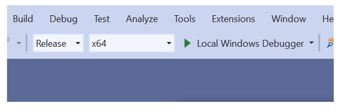
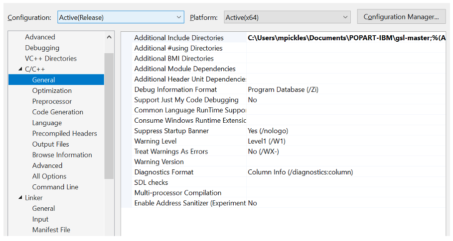
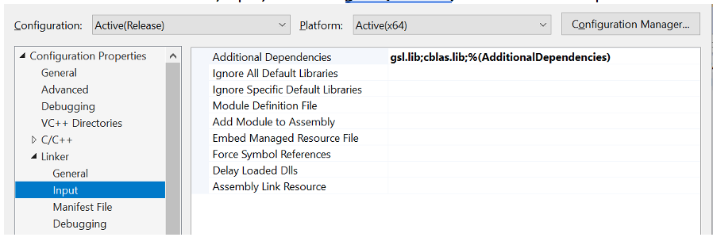
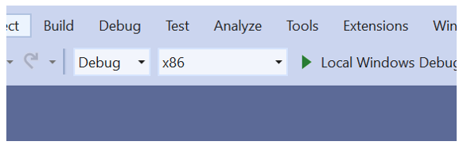

# Running PopART-IBM on Windows

*December 2020*

The following instructions are for Visual Studio. We use Visual Studio Community 2019, version 16.8 (available at [https://visualstudio.microsoft.com/downloads/](https://visualstudio.microsoft.com/downloads/)).

**If you do not have the GNU Scientific Library (GSL), see the instructions later regarding how to build it.**

* Here we assume you will work from the .zip file. 
* You can also clone the repository if you prefer
* We also assume that you will download all the files into a folder `C:\Users\my_username\Documents\POPART-IBM`
(where `my_username` is replaced with whatever your user id is on your computer).
* For now we work in release model and work in 64 bit mode.  

**Downloading the PopART IBM files**

* From the POPART-IBM repository (https://github.com/BDI-pathogens/POPART-IBM), click on the green *Code* button, and choose *Download zip*
* Unzip the file

**To load the PopART-IBM code into Visual Studio:**

* Choose *File -> New -> Project from Existing Code...*
* Type of project is *Visual C++*
* Project file location is the `src` subdirectory in the unzipped PopART-IBM file.
* Choose a meaningful project name (e.g. *PopART-IBM*)
* All other settings are default

**Building the code**

* Set solution configurations/platforms to *Release* and *x64* (from *Debug* and *x86* – see below for picture):

* Right-click on *PopART-IBM* (or your project name) on Solution Explorer (the window on the right hand side).
* Choose *Properties*. In the pop-up box, make sure *Configuration* is set to *Active(Release)* or *Release*, and Platform is *Active(x64)* or *x64*.

**Linking to GSL:**

* Choose *C/C++, General*, and look at the *Additional Include Directories* field. It's semi-colon separated. Insert the location of the main GSL directory (the one containing the `gsl/` subdirectory that has the gsl headers, i.e. files such as `gsl_blas.h`), for example `C:\Users\my_username\Documents\POPART-IBM\gsl-master;`

* Choose Linker, Input, and insert `gsl.lib;cblas.lib;` into *Additional Dependencies*.

* Choose *Linker, General*, and look for *Additional Library Directories*. Insert
`C:\Users\ my_username \Documents\POPART-IBM\gsl-master\lib;` Depending on how you compiled GSL, the above may change. 

## Compiling and running the code:

**Setting up command-line arguments:**

* Right-click on *PopART-IBM* (or your project name) on *Solution Explorer* (the window on the right hand side).
*Choose *Properties*
* Now choose *Debugging*, and look for *Command Arguments*. Insert the following:
`C:\Users\my_username\Documents\POPART_IBM_PAPER1_TEST_INSTALL\PARAMS_COMMUNITY5 1`

## Setting up the GNU scientific library (GSL) for Windows

* Download/clone the GSL repo: [https://github.com/BrianGladman/gsl](https://github.com/BrianGladman/gsl)
* Download and unzip the `gsl-master` zip file.  We assume it is placed in a folder `C:\Users\my_username\Documents\POPART-IBM\gsl-master`
* Open project/solution`C:\Users\my_username\Documents\POPART-IBM\gsl-master\build.vc\gslhdrs\gslhdrs.vcxproj`
* Set solution configurations/platforms to *Release* and *x64* (from *Debug* and *x86* – see below for picture)

* *Build* -> *Build solution*
* Open project/solution: `C:\Users\my_username\Documents\POPART-IBM\gsl-master\build.vc\gsllib\`
* Set solution configurations/platforms to *Release* and *x64* (from *Debug* and *x86* – see below for picture), and build solution.
* Open project/solution: `C:\Users\my_username\Documents\POPART-IBM\gsl-master\build.vc\cblaslib\`
* Set solution configurations/platforms to *Release* and *x64* (from *Debug* and *x86*), and build solution.
